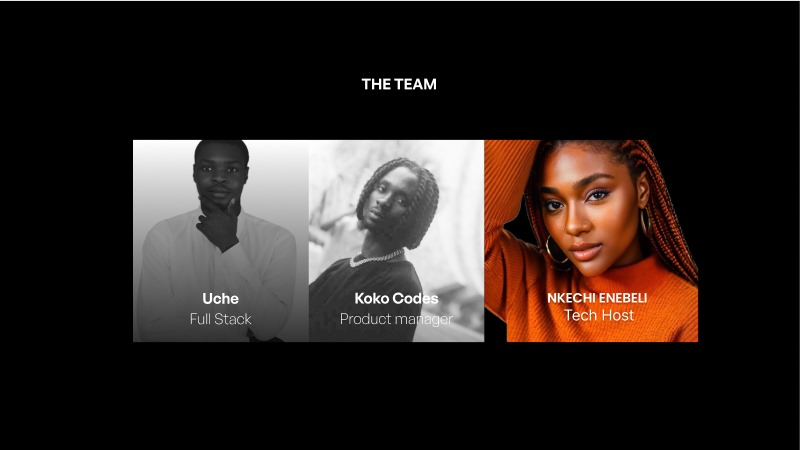

# PodFi-MVP  🌟

## Welcome to the PodFi MVP repository

<p align="center" width="100%">
  
</p>

> ## Table of contents
- [Inspiration](#inspiration)
- [What-it-does](#what-it-does)
- [How-we-built-it](how-we-built-it)
- [Technologies](#technologies)
- [What's-next-for-podfi](What's-next-for-podfi)
- [Repo Setup](#repo-setup)
- [Requirements](#requirements)
- [Setup the Project](#setup-the-project)
  - [Install Dependencies](#install-dependencies)
  - [Steps to host the live site on Vercel](#steps-to-host-the-live-site-on-vercel)
- [Live Link](#live-link)
- [Contributors](#contributors)
- [Contributing to the project](#contributing-to-the-project)

  
#
> ## Inspiration
<p align="justify">
As a content creator, sometimes I get tired of creating contents, this is not because I don’t lack the ideas or the enthusiasm, it’s rather cos I know when I create content most times, I don’t get the right engagements that I would like or the value for my content. I mean, it’s a constant case of content creators struggling to be seen. We post our contents on these platforms, it generates a lot of revenue for them but we don’t get to partake in that or even if we do, it’s only a very small fraction.

Our project, PodFi; a decentralized podcasting ecosystem built on the ethereum sepolia blockchain, was born out of this pain that I experienced as a podcast creator, but thanks to Web3, thanks to decentralization, thanks to transparency, and thanks to inclusivity, I and my team  members; Emmanuel Enebeli and Uche was able to create a product that would help tackle this challenge and make podcasting more desirable and valuable for both the creators as well as the listeners.

</p>

#
> ## What-it-does
>


### Tokenized Listener Rewards:
- Implemented a reward system where listeners earn native tokens (PodTokens) for engaging with podcasts. This includes activities like listening, sharing, and leaving comments.

### Reward Redemption:
- We make it possible for  users to redeem earned PodTokens.
Options for converting tokens to premium subscriptions, accessing exclusive content, or participating in platform events.

### Engagement Analytics:
Provides listeners with analytics on their engagement activities and earned PodTokens.
Displays trends, historical data, and potential strategies for maximizing token accumulation.

### Podcast Creators
#### Incentivizing Quality Content:
- Creators can set PodToken rewards for listeners engaging with their podcasts.
Enhanced analytics provide insights into how engagement impacts token rewards.

### Decentralized Ad Marketplace:
-  a decentralized marketplace where advertisers can directly connect with podcasters for ad placements. Smart contracts ensure transparent and fair revenue distribution between creators and advertisers.


#
> ## Technologies
| <b><u>Stack</u></b> | <b><u>Usage</u></b> |
| :------------------ | :------------------ |
| **`React`**      | Frontend     |
| **`The Graph`**      | Indexing     |
| **`Huddle01`**      | Live streaming  |
| **`Hono`**      | Backend(IPFS Proxies|

#
> ## Repo Setup

<p align="justify">
To setup the repo, first fork the podfi-muaccra Repo, then clone the forked repository to create a copy on the local machine.
</p>

    $ git clone https://github.com/Adophilus/podfi-muaccra.git

<p align="justify">
Change directory to the cloned repo and set the original podfi-muaccra repository as the "upstream" and your forked repository as the "origin" using gitbash. 
</p>

    $ git remote add upstream  https://github.com/Adophilus/podfi-muaccra.git

#

> ## Requirements
#
- Node JS


## Explainer video (User POV)

https://github.com/EnebeliEmmanuel/PodFi/assets/58889001/43876dbc-57e9-4653-8f3e-b68cf71a06db


## Useful links

- [Prensentation slides](https://www.figma.com/proto/XQ5miYBS5ZJiSwjzRk0EpW/Hack-Template---HT-OS?node-id=1-6&t=rUOu39YW5c0eN0JA-0&scaling=contain&content-scaling=fixed&page-id=0%3A1&starting-point-node-id=1%3A6)
- [Frontend Deployment]()


> ## Contributors

This Project was created by these awesome dedicated members

<p align="center" width="100%">
  
</p>


> ## What's next for PodFi
- Enhanced Tokenized Rewards System
We plan to refine and expand our tokenized rewards system to provide more engaging and diverse opportunities for both creators and listeners. This will include introducing new ways for listeners to earn PodTokens, such as through interactive polls, challenges, and exclusive content access.

- Advanced Analytics and Insights
Our team is working on developing more advanced analytics tools that provide deeper insights into listener behavior and engagement. These tools will help creators understand their audience better and tailor their content to meet listener preferences, thereby increasing retention and satisfaction.

- Decentralized Ad Marketplace Expansion
We aim to expand our decentralized ad marketplace to include more brands and advertisers. This will provide creators with greater opportunities to monetize their content and offer listeners a more personalized and relevant ad experience. The marketplace will be enhanced with improved targeting and performance tracking features.

- Partnerships and Integrations
PodFi will continue to seek strategic partnerships and integrations with other platforms and technologies to expand our reach and functionality. Collaborations with popular podcasting apps, social media platforms, and blockchain projects will be pursued to enhance the user experience and drive growth.

- Community Building and Governance
We are committed to building a strong and vibrant community around PodFi. This includes launching initiatives to increase community engagement, such as creator and listener meetups, webinars, and interactive events. Additionally, we will introduce a decentralized governance model that allows community members to have a say in the platform’s development and future direction.


#
> ## Contributing to the project

If you find something worth contributing, please fork the repo, make a pull request and add valid and well-reasoned explanations about your changes or comments.

Before adding a pull request, please note:

- This is an open source project.
- Your contributions should be inviting and clear.
- Any additions should be relevant.
- New features should be easy to contribute to.

> ## Deployed Contracts

Platform:https://sepolia.etherscan.io/address/0x0E09e608b8f481118D0BFDB35570C1d543576a50
PodcastFi: https://sepolia.etherscan.io/address/0xB1F93057253524655A5eB7797814Cd26e2433FBF
PodToken: https://sepolia.etherscan.io/address/0xc257c84c0B43bcda4C5EAA10ddababCF0418Ea48


# PodFi Platform Overview

PodFi is an innovative platform designed to revolutionize the podcasting industry through blockchain technology. It integrates user and content management systems, token-based incentives, and decentralized governance to create a vibrant and interactive ecosystem for both listeners and creators. Additionally, PodFi provides a seamless connection between brands and podcasters, allowing for effective advertising and engagement.

## User Storage

The UserStorage contract is responsible for managing user data on the PodFi platform. It includes functionality to store, retrieve, and update user information securely.

### User Structure

- username: The unique username of the user.
- name: The full name of the user.
- addr: The Ethereum address of the user.
- profilePictureHash: The IPFS hash of the user's profile picture.
- subscribers: The number of subscribers the user has.
- bio: A short biography of the user.

### User Management Functions

- getByUsername: Retrieves a user by their username.
- getByAddress: Retrieves a user by their Ethereum address.
- store: Stores a new user's information.
- _doesUserExist: Checks if a user exists.

### Example

```solidity
UserStorage userStorage = new UserStorage(ownerAddress);

// Storing a new user
userStorage.store(
    userAddress,
    "john_doe",
    "John Doe",
    "Podcaster and tech enthusiast",
    "QmHashOfProfilePicture"
);

// Retrieving a user by username
UserStorage.User memory user = userStorage.getByUsername("john_doe");
Podcast Storage
The PodcastStorage contract is responsible for managing podcast data. It includes functionality to store, update, and retrieve podcast information securely.

Podcast Structure
id: The unique identifier of the podcast.
creatorAddress: The Ethereum address of the podcast creator.
title: The title of the podcast.
description: A description of the podcast.
duration: The duration of the podcast in seconds.
recordingHash: The IPFS hash of the podcast recording.
streamingCode: The streaming code for live podcasts.
type_: The type of the podcast (Audio/Video).
status: The streaming status of the podcast.
publishedAt: The timestamp when the podcast was published.
Podcast Management Functions
store: Stores a new podcast's information.
update: Updates an existing podcast's information.
getById: Retrieves a podcast by its unique identifier.
getByCreatorAddress: Retrieves all podcasts created by a specific address.
_doesPodcastExist: Checks if a podcast exists.
Example
solidity
Copy code
PodcastStorage podcastStorage = new PodcastStorage(ownerAddress);

// Storing a new podcast
podcastStorage.store(
    "podcast1",
    creatorAddress,
    "The Tech Talk",
    "A podcast about the latest in tech",
    3600,
    "QmHashOfRecording",
    "streamingCode123",
    PodcastStorage.Type.Audio,
    PodcastStorage.Status.StreamingNotStarted
);

// Retrieving a podcast by ID
PodcastStorage.Podcast memory podcast = podcastStorage.getById("podcast1");
Tokenomics and Rewards
PodFi uses its native token, PodToken (POD), to incentivize users and facilitate transactions within the ecosystem.

Listener Rewards
Listeners can earn POD tokens through various interactions on the platform:

Listening: Users earn POD tokens based on the number of hours they listen to podcasts. The reward rate is 1 POD per hour.
Liking: Users receive 0.1 POD for each like they give to a podcast.
Commenting: Users earn 0.5 POD for each comment they make on a podcast.
Sharing: Users receive 2 POD for sharing a podcast.
Example
solidity
Copy code
function rewardListener(
    string memory podcastId,
    address listener,
    uint256 hoursListened,
    uint256 likes,
    uint256 comments,
    uint256 shares
) external onlyOwner {
    uint256 totalReward = (hoursListened * rewardRatePerHour) + 
                          (likes * likeReward) + 
                          (comments * commentReward) + 
                          (shares * shareReward);
    PodcastStorage.Podcast memory podcast = podcastStorage.getById(podcastId);
    ERC20Token(podcast.podToken).mint(listener, totalReward);
}

### Tokenized Polls
PodFi allows for decentralized governance through tokenized polls. Users can create and vote on polls, with voting power determined by the number of POD tokens they hold.

### Creating Polls
Only the owner can create new polls.

### Voting
Users vote on polls using their POD tokens, and their voting power is proportional to their token holdings.

Example
solidity
function createPoll(string memory question, string[] memory options) external onlyOwner {
    uint256 pollId = _pollIdCounter.current();
    Poll storage newPoll = polls[pollId];
    newPoll.question = question;
    for (uint256 i = 0; i < options.length; i++) {
        newPoll.options.push(options[i]);
    }
    _pollIdCounter.increment();
    emit PollCreated(pollId, question);
}

function vote(string memory podcastId, uint256 pollId, uint256 option) external {
    require(option < polls[pollId].options.length, "Invalid option");
    require(!polls[pollId].hasVoted[msg.sender], "Already voted");
    PodcastStorage.Podcast memory podcast = podcastStorage.getById(podcastId);
    ERC20Token podToken = ERC20Token(podcast.podToken);
    uint256 voterBalance = podToken.balanceOf(msg.sender);
    require(voterBalance > 0, "No voting power");

    polls[pollId].votes[option] += voterBalance;
    polls[pollId].hasVoted[msg.sender] = true;
    emit VoteCast(msg.sender, pollId, option, voterBalance);
}
```

### Advertising Integration
Our platform also pushes for advertising through podcasts. Brands can connect with podcasters to advertise their products directly on the PodFi platform. This integration allows brands to:

### Buy PodTokens (POD): Brands must purchase POD tokens to pay fees for advertising activities.
Connect with Podcasters: Brands can easily connect with podcasters to discuss and set up advertising deals.
Incentivize Users: Brands can create incentives or rewards for users who engage with their advertised products.
Example

```solidity
// Brand buying POD tokens for advertising
usdcToken.transferFrom(brandAddress, platformAddress, usdcAmount);
podToken.mint(brandAddress, podAmount);

// Brand setting up a reward for users
rewardListener("podcast1", userAddress, hoursListened, likes, comments, shares);
```

# PodFi Tokenomics with Advertising Integration


## Pod Tokens (POD)

- *Token Type*: ERC20
- *Token Name*: PodToken
- *Token Symbol*: POD

## Initial Token Distribution

- *Total Supply*: 1,000,000 POD
- *Allocation*:
  - *Platform Development and Operations*: 30% (300,000 POD)
  - *Community Rewards and Incentives*: 40% (400,000 POD)
  - *Founding Team and Advisors*: 20% (200,000 POD)
  - *Partnerships and Marketing*: 10% (100,000 POD)

## Token Utility

### Listener Incentives
- *Listening Rewards*: Users earn POD for every hour of listening to podcasts.
- *Engagement Rewards*: Additional POD tokens for likes, comments, and shares.

### Creator Benefits
- *Tokenized Feedback*: Creators can set up polls to get community feedback, incentivizing engagement with POD rewards.
- *Content Monetization*: Creators receive POD based on listener engagement and interaction with their content.

### Redemption and Benefits
- *Exclusive Access*: POD can be redeemed for NFTs, free access to live events, and exclusive content.
- *Ranking and Influence*: Accumulating more POD allows users to rank higher on the platform and gain more influence in community decisions.

### DAO Integration
- *Voting Power*: Users with more POD have greater voting power in platform governance and decision-making processes.
- *Poll Creation*: Tokenized polls enable creators and the platform to receive valuable feedback from the community.

### Token Swap
- *USDC Conversion*: Users can swap POD tokens for USDC. They send POD to a contract, which then transfers the equivalent amount in USDC to their wallet.

### Advertising Integration
- *Advertising Opportunities*: Brands can connect with podcasters to advertise their products on the platform.
- *Payment in POD*: Brands are required to buy POD tokens to pay fees for advertising activities.
- *Incentives for Users*: Brands can set up rewards for users who engage with their products being advertised, creating a mutually beneficial ecosystem.

## Reward Distribution Mechanism

- *Listening Reward Rate*: 1 POD per hour of listening.
- *Like Reward*: 0.1 POD per like.
- *Comment Reward*: 0.5 POD per comment.
- *Share Reward*: 2 POD per share.

## Governance and Voting

- *Poll Creation*: Only the platform owner can create polls initially.
- *Voting Mechanism*: Users vote on polls using their POD balance, with voting power proportional to their holdings.
- *Poll Results*: The results are publicly accessible, ensuring transparency in decision-making.

## Economic Sustainability

- *Periodic Adjustments*: Reward rates and token distribution strategies can be adjusted based on platform growth and user engagement metrics.
- *Incentive Balancing*: Ensuring a balanced and sustainable reward system that incentivizes long-term engagement without leading to excessive inflation of the token supply.

## Conclusion

PodFi’s tokenomics are designed to create a vibrant and interactive podcast ecosystem by incentivizing user engagement, providing tangible benefits, and integrating advertising opportunities. Through the use of Pod Tokens, the platform enables decentralized governance, enhances user experience, and supports sustainable growth.

PodFi's integration of UserStorage and PodcastStorage ensures robust and secure management of user and podcast data. The tokenomics system rewards users for their engagement and participation, while the decentralized governance model allows for community-driven decision-making. The advertising integration provides a valuable opportunity for brands to connect with the podcasting community, enhancing the overall ecosystem with incentives and rewards. Through these

All **`suggestions`** are welcome!
#
> ##### README Created by `Enebeli Emmanuel` for PodFi

